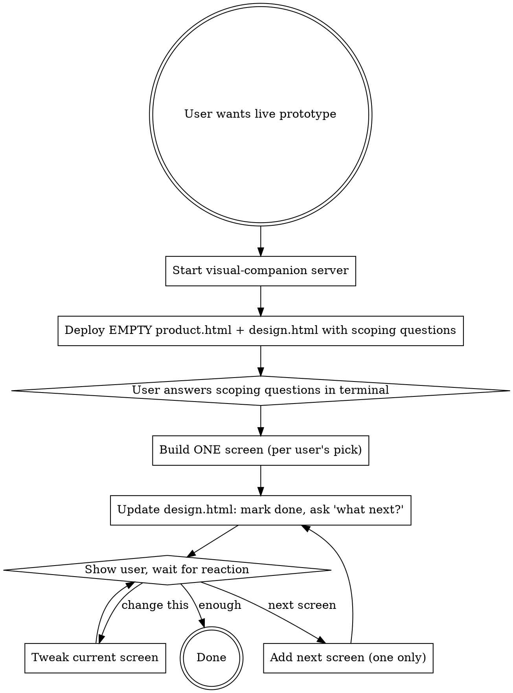

# Design Prototype

## Overview

A lightweight pattern for building **working clickable prototypes** that feel like the real product, modified through conversation. Reuses the brainstorming visual-companion server (no new infrastructure) but flips its purpose: instead of A/B/C choice cards or static mockups, the user actually uses the product — hover, click, type, drag — and tells you what to change in natural language.

**The three non-negotiables:**
1. **Working interactions**, not static demos. Hover states fade in. Clicks change state. Inputs accept typing. Modals open and close. Animations play. The user should be able to "play" with the product.
2. **Conversation-driven modification**. The user talks to you about what to change ("the dock feels too tall", "make the ✓ button green instead"). You edit the single file. Browser auto-reloads. The user is still on the same screen, can keep clicking.
3. **One screen at a time — collaborative, not delivered.** NEVER generate the full multi-screen prototype on the first invocation. The whole point is co-design: you produce an empty/minimal canvas + a `design.html` that asks the scoping questions (user, scenario, first screen, tone), the user answers, you add ONE screen, show it, ask for feedback, then add the next. Front-loading 5+ screens robs the user of the conversation that justifies this skill over `frontend-design`. If you catch yourself drafting screen #2 before screen #1 has been seen and reacted to, stop.

**Core architecture — two browser tabs:**
- **Left tab — `product.html`**: the working clickable prototype. Single HTML file, all screens, hash routing, full JS interactivity.
- **Right tab — `design.html`**: the **ClaudeDesign** panel where you (Claude) display proposals, recent changes, roadmap, design tokens, and open questions. The user reads this and replies in terminal.

Both files live in the visual-companion `screen_dir`. The user opens two browser windows side-by-side:
- `http://localhost:PORT/files/product.html`
- `http://localhost:PORT/files/design.html`

The visual-companion watcher reloads both tabs on any HTML change. Cross-tab navigation/sync can use `BroadcastChannel` (same-origin).

Conversation happens in the **Claude terminal**, not in the browser. The design panel is read-only for the user — they see your proposals there, they reply in terminal, you edit files, browser reloads.

## When to Use

**Triggers:**
- User says "let me see the actual product, not choice cards"
- User says "I want to click around and feel it"
- User wants to dogfood — use the product as if real
- After brainstorming has produced multiple UX decisions and the user wants a coherent clickable prototype
- User says "let's polish this for a while" or "long iteration session"
- User says "make it feel like the real thing"

**Do NOT use when:**
- Picking between 2-3 design options — use `superpowers:brainstorming` visual companion instead
- Producing static screenshots — that's a slide deck, not a prototype
- The user wants pixel-perfect Figma output — recommend a real design tool
- Producing final production code — use `frontend-design` skill

## The Pattern

### One file, many screens, hash routing

```
<single file: prototype.html>
  <style> design tokens + shared CSS </style>
  <nav> screen switcher </nav>
  <section data-screen="home" class="screen active">...</section>
  <section data-screen="board" class="screen">...</section>
  <section data-screen="dashboard" class="screen">...</section>
  <script> hash router: read location.hash → show matching section </script>
```

Edit any part → fs.watch fires → WebSocket reload → browser refreshes preserving the current `#screen-hash`.

### How the server fits

The brainstorming visual-companion server (`scripts/start-server.sh`) does exactly what we need:
- Serves the newest `.html` file at `/`
- Watches the screen dir, broadcasts WebSocket reload on file change
- 30-min idle timeout

We just write a single `prototype.html` to the screen dir. No fragments, no choice cards — a full document (server detects `<!DOCTYPE` / `<html`) and passes it through unmodified.

## Quick Reference

| Task | Action |
|---|---|
| Start a session | Run `~/.claude/plugins/cache/claude-plugins-official/superpowers/*/skills/brainstorming/scripts/start-server.sh --project-dir <project>`. Save `screen_dir` from output. |
| Deploy | Copy `templates/product.html` and `templates/design.html` to `screen_dir`. Tell user to open both `/files/product.html` and `/files/design.html` side-by-side. |
| Add a screen to product | Add `<section data-screen="NAME">...</section>` and `<a data-nav="NAME">` in nav. Mark blueprint screens with `data-blueprint`. |
| Add a proposal to design panel | Edit `design.html` — add to "Recent proposals" or "Suggestions" sections. |
| Update a design token | Edit the CSS variable in both `product.html` and `design.html`. Save → both tabs reload. |
| Mark a screen done | Remove `data-blueprint` from the section + update status in `design.html` roadmap. |
| Cross-tab navigation | Use `BroadcastChannel('filmmaker')` — design.html posts, product.html listens. |

## DESIGN.md is the Source of Truth (When It Exists)

**Before writing any product.html / design.html, check the project root for `DESIGN.md`.** If it exists, treat it as the authoritative design system — extract colors, typography, spacing, radius, and component tokens directly from its YAML frontmatter or content. Do NOT pick a design direction independently.

Common patterns:
- `colors:` / `typography:` / `spacing:` / `rounded:` / `components:` blocks in YAML frontmatter
- A `## Do's and Don'ts` section that constrains your choices
- Specific font fallback guidance (e.g., "Use Inter when SF Pro unavailable")

If DESIGN.md changes mid-session (user adds it or edits it), do a full rebuild of product.html and design.html against the new tokens. Don't try to retrofit piecemeal — the design system is foundational, and partial application creates the "gallery" failure mode.

If no DESIGN.md exists, propose one early or commit to a system clearly (e.g., "Studio Neutral" or "Apple-design") and document it inline.

## Product Cohesion Pass (Required Before Saying "Done")

**The single biggest failure mode of this skill** is producing a "gallery of design decisions" instead of "one coherent product". Each screen looks fine in isolation but feels like it was designed by a different person.

After every batch of new/edited screens, run this checklist. Treat it as the GREEN→REFACTOR step. If you skip it, the prototype reads as a portfolio piece, not a working tool.

### 1. One canonical world

The whole prototype must look like the **same user, on the same day, looking at the same project**. Pick one data slice and stick to it everywhere:

- One active project name (e.g., "비글루 시즌 2")
- One active episode + scene combo (e.g., EP03 / S12)
- Same team members in every avatar stack
- Same timestamps/relative times that match across screens
- Same counts (if dashboard says "11/24", the board MUST show 11 done out of 24)

If a number appears in two places, they must agree.

### 2. Strip internal vocabulary

Internal design labels from brainstorming MUST NOT leak into product UI:

| Internal label (do NOT show) | Product label (show this) |
|---|---|
| "Director's Bridge" | "Dashboard" or just the team name |
| "Diff Grid" / "Variant Stack" | "Variants" or character name |
| "Canvas-first" / "Polaroid" | (no label needed — it's just the board) |
| "Hover Toolbar" | (no label — it's just hover) |
| "Filmstrip" | "Scenes" or just the strip itself |
| "Blueprint" | "Planned for Phase X" or similar |

If you find yourself adding a UI label that describes the *design choice*, delete it.

### 3. One naming convention per entity type

Pick once, apply everywhere. Examples of decisions to lock in:

- Shot IDs: `shot_02` (snake mono) OR `SHOT 02` (caps) OR `Shot 02` (title) — **not** mixed
- Scene IDs: `S12` OR `scene_12` OR `Scene 12` — **not** mixed
- User names: `김디렉터` OR `Director Kim` OR `KD` — **not** mixed
- Dates: `2026-05-12` OR `5/12` OR `12 May` — **not** mixed
- Durations: `2.4s` OR `2400ms` OR `2.4초` — **not** mixed

Studio Neutral usually pairs `snake_case` mono for IDs with title case for human strings.

### 4. Iconography discipline

Pick **one register** and stay there:

- **Minimal unicode set** (recommended for Studio Neutral): `★ ✓ ✕ @ ◇ ⌕ ↵ ⌘ ↑ ↓ ← →` only
- OR **monochrome line icons** (SVG, single stroke weight)
- OR **filled glyphs** (single style)

Decorative emoji (🔔 🛠 🔀 📦 🎬 🎥) are **forbidden** unless the entire prototype uses them — they break the register.

For the FilmMaker design system, `★` (master) + `✓` (approved) + `✕` (rejected) + `@` (asset) + `◇` (default) is sufficient. Replace every other glyph.

### 5. Information density rhythm

Across screens, the user shouldn't feel "this screen is busy / this screen is empty" without reason. Aim for the same:

- Content max-width per screen type (full-bleed vs centered column vs split)
- Section gap (typically 24–32px)
- Card padding (typically 14–18px)
- Vertical rhythm — section heads use the same scale, body text uses the same scale

If one screen is noticeably denser or sparser than peers, either redistribute content or add visual breathing/density to match.

### 6. No meta-text in product screens

The product UI must not explain itself. Forbidden:
- "Hover here to see X"
- "Click any card to..."
- "This is the [feature name] view"
- "Try ⌘L to..."

These belong in `design.html` (the ClaudeDesign panel) or an onboarding tour — never the product itself.

### 7. State coverage per surface

For each interactive surface, ask: does this show the **realistic** version?

- ✅ Default (happy) state
- ✅ Loading (skeleton, progress) — match the real wait time
- ✅ Empty (no data yet, with a helpful next step)
- ✅ Error (with retry)

A prototype that only shows happy state feels like a screenshot, not a product.

### 8. Active context propagates

If the user navigates from board (scene 12) to asset to dashboard and back, the breadcrumbs, "current scene" highlights, and "you were here last" hints should all consistently reflect that. Cross-screen state should never reset to a stranger.

### Cohesion pass checklist (run before saying "done")

```
[ ] All numbers/counts/timestamps cross-validate
[ ] Zero internal design labels in UI strings
[ ] Single naming convention per entity type
[ ] Single icon register, decorative emoji removed
[ ] Section gaps + card paddings consistent
[ ] No meta-text explaining the UI
[ ] Each surface has loading + empty + error states
[ ] Active context (project/scene/user) consistent everywhere
```

If any box is unchecked, the prototype is not done — it's still a gallery.

---

## Blueprint Pattern (Unfinished Screens)

Screens not yet designed get a **blueprint placeholder** instead of being blank or hidden. Pattern:

```html
<section class="screen blueprint" data-screen="storyboard" data-blueprint>
  <div class="blueprint-wrap">
    <span class="bp-stage">PLANNED</span>
    <h2>storyboard</h2>
    <p>마스터샷 승인 후 컷 시퀀스를 구성하는 단계. Canvas + Sequence Lane.</p>
    <button onclick="openDesignPanel('storyboard')">→ ClaudeDesign에서 제안 받기</button>
  </div>
</section>
```

Why blueprint over blank:
- Navigation stays complete (all tabs visible)
- Status is explicit (PLANNED / WIP / DONE)
- Creates a natural starting point for design conversation
- One click → design panel focuses on proposing that screen

## Starter Templates

- `templates/product.html` — the working prototype with full interactivity layer (Studio Neutral tokens, hash router, interactive components, blueprint pattern)
- `templates/design.html` — the ClaudeDesign panel (current focus, recent changes, roadmap, tokens, suggestions, open questions)

## Workflow

The flow has two distinct phases. Phase 1 is "scoping" — you deploy an empty canvas and a question panel, the user answers. Phase 2 is "one screen at a time" — you add a single screen, the user reacts, you add the next.



### Phase 1 deploy checklist (first invocation)
- `product.html` is an **empty/placeholder canvas** — a single centered "v0 · 시작 전" message pointing the user to the design panel. NO screens, NO nav, NO mock data.
- `design.html` contains, at minimum: a "current state: nothing built" focus card, and 3-5 scoping questions covering (a) target user, (b) primary scenario, (c) differentiator vs alternatives, (d) which screen to start with, (e) visual tone deviations from DESIGN.md.
- Tell the user: "답할 수 있는 만큼만 답해 주세요. 하나라도 답해주시면 시작합니다." Do NOT proceed without at least the first-screen choice.

### Phase 2 loop (every subsequent turn)
- Build exactly ONE new screen OR tweak ONE existing screen per turn.
- After each change, update `design.html` to reflect the new roadmap state and surface 1-3 next-decision options.
- End every turn by explicitly asking what to do next — never queue up implicit "I'll also add X" work.

## Reporting the Current Screen to Claude

By default, the user navigates and Claude (terminal) has no idea which screen is shown. Fix: open a direct WebSocket from `product.html` to the visual-companion server.

**Important gotcha:** files served via `/files/*` (the two-tab pattern) do NOT get the helper.js injected — only `/` gets it. So `window.brainstorm` is `undefined` on `product.html` and `design.html`. Open your own WS client.

Inline in `product.html`:

```js
let _ws = null;
let _wsQueue = [];
function _wsConnect() {
  _ws = new WebSocket('ws://' + location.host);
  _ws.onopen = () => { _wsQueue.forEach(e => _ws.send(JSON.stringify(e))); _wsQueue = []; };
  _ws.onclose = () => setTimeout(_wsConnect, 1000);
  _ws.onmessage = (m) => {
    try { const d = JSON.parse(m.data); if (d.type === 'reload') location.reload(); } catch (e) {}
  };
}
_wsConnect();
function reportToClaude(event) {
  event.timestamp = Date.now();
  if (_ws && _ws.readyState === WebSocket.OPEN) _ws.send(JSON.stringify(event));
  else _wsQueue.push(event);
}
// Call on every route change:
reportToClaude({ type: 'screen-viewed', screen: hash, source: 'product' });
```

(Bonus: the onmessage→reload makes the file auto-reload on HTML changes, same as helper.js.)

**Reading from Claude's side:** the server logs every WS message to `$STATE_DIR/server.log` via `console.log({source:'user-event', ...event})`. So:

```bash
grep '"screen-viewed"' $STATE_DIR/server.log | tail -1
```

**Why not `$STATE_DIR/events`?** The visual-companion only writes to `events` if `event.choice` is set (the A/B card click pattern). Custom events like `screen-viewed` go only to server.log.

## Conventions

### Design tokens go at the top of `<style>`

```css
:root {
  --bg-canvas: #0c0d0f;
  --bg-chrome: #101113;
  --bg-card: #16181c;
  --accent: #5cebc6;
  --text-primary: #e8eaee;
  --text-muted: #9095a0;
  --radius-card: 6px;
  --radius-dock: 14px;
}
```

Changing a token here propagates to all screens. This is the single source of truth.

### Screen sections are self-contained

Each `<section data-screen="X">` should be a complete view. No CSS dependencies between screens. Components shared across screens go in a "components" stylesheet section above the screens.

### Nav highlights current screen via JS

The router (see template) toggles `.active` on the nav link matching `location.hash`. CSS handles the visual.

### Persistent screen on reload

Keep the active screen via `location.hash`. Since WebSocket reload uses `window.location.reload()` (no `?force=true`), the hash survives.

## Common Mistakes

| Mistake | Fix |
|---|---|
| Splitting screens into multiple HTML files | Defeats the auto-reload + single-token-source benefit. Keep one file (or one per pane: product/design). |
| Linking external CSS (`tokens.css`) | The watcher only triggers on `.html` changes. Use inline `<style>` instead. |
| Forgetting `<!DOCTYPE html>` | Server wraps fragments in a frame template. Full docs need DOCTYPE so they pass through unmodified. |
| Using `setTimeout` for state | Hash-based routing only. Browser back/forward should work. |
| Loading large images | Use CSS gradients for thumbnails (e.g., `linear-gradient(135deg,#3a2d2d,#2a3340)`). Real images bloat the file and slow reloads. |
| **Assembling brainstorm picks without cohesion pass** | The biggest failure mode — produces a "gallery of decisions" not a product. ALWAYS run the cohesion checklist above. |
| **Decorative emoji** (🔔 🛠 🔀 📦 🎬) **mixed with unicode** (★ ✓ ✕) | Pick one register. See Iconography Discipline. |
| **Meta-text in product UI** ("Hover here to see X") | Move to design.html or onboarding tour. Never in the product. |
| **Numbers/counts that don't cross-validate** between screens | Dashboard says "11/24"? Board MUST show 11/24. Asset says "14씬 사용"? Search for that character across screens — it MUST appear in 14. |
| **Building the whole prototype on the first turn** | The single most damaging mistake — turns a co-design tool into a one-shot delivery. ALWAYS deploy an empty canvas + design.html scoping questions FIRST, wait for the user to pick a starting screen, then add ONE screen per turn. See "Phase 1 deploy checklist". |
| **Queueing implicit follow-up work** ("I'll also add the analytics screen next") | Every turn ends with an explicit question. Never assume the next screen. The user might want to iterate on the current one for 20 minutes. |

## Real-World Impact

This pattern emerged during a 17-decision UX brainstorm for the FilmMaker project (2026-05-12). The user spent hours in `superpowers:brainstorming` visual-companion picking A/B/C cards, then asked for a unified navigable prototype to polish further. The cards-only model couldn't deliver that. This skill captures the lighter-weight alternative.

## Testing Status

**This skill is not yet pressure-tested with subagents** (per `superpowers:writing-skills` TDD methodology). It is documented based on direct experience but lacks RED-phase baseline scenarios. If you adopt it for non-personal work, add tests per the TDD checklist.
